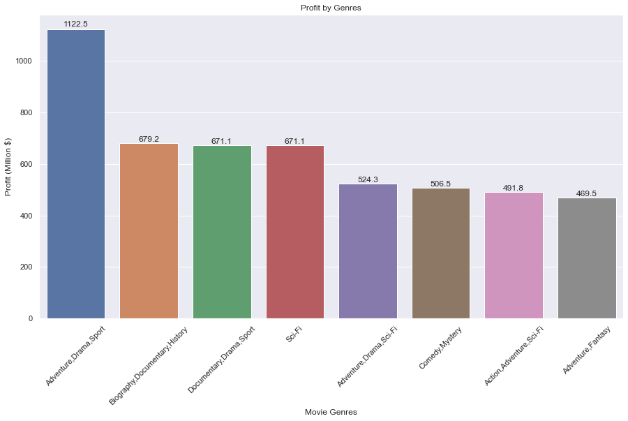
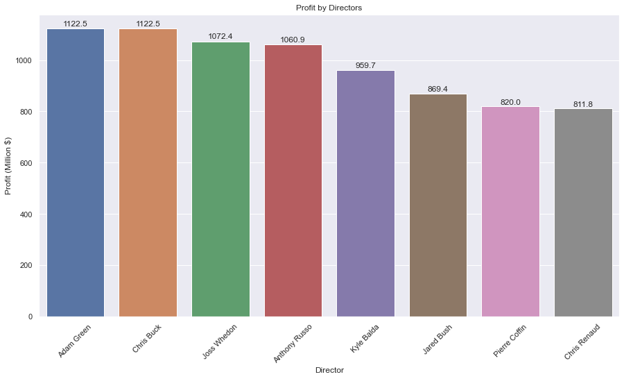
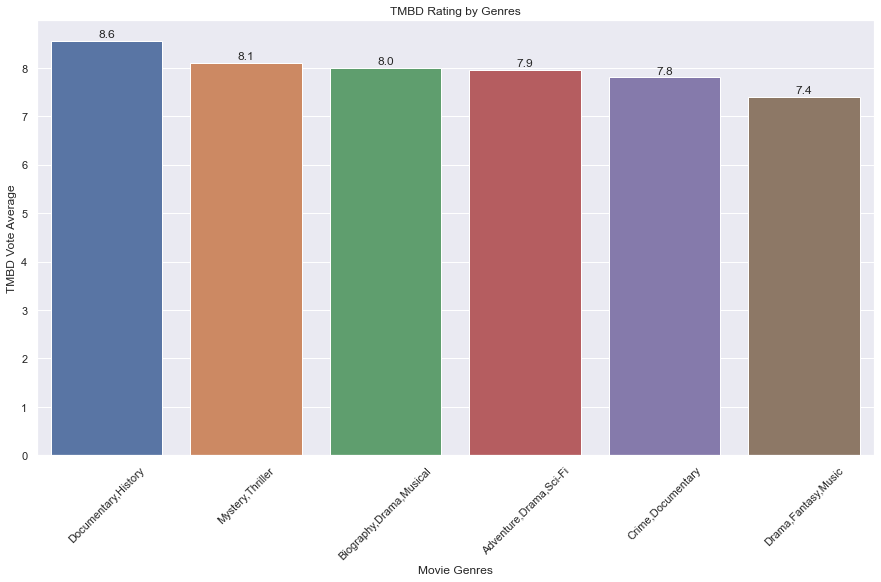
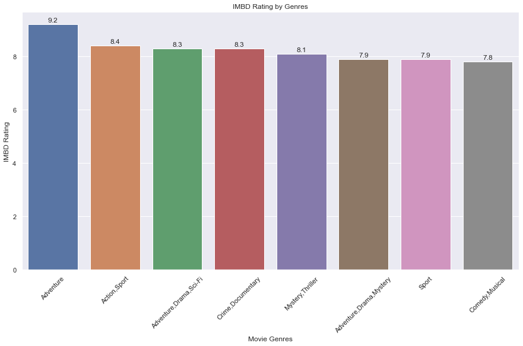
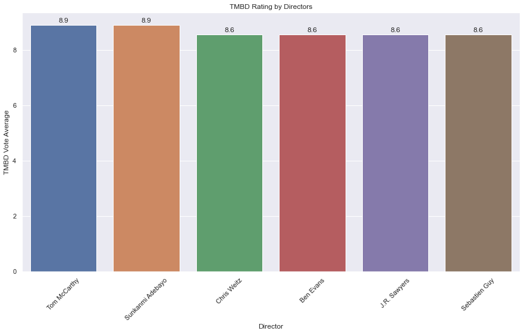
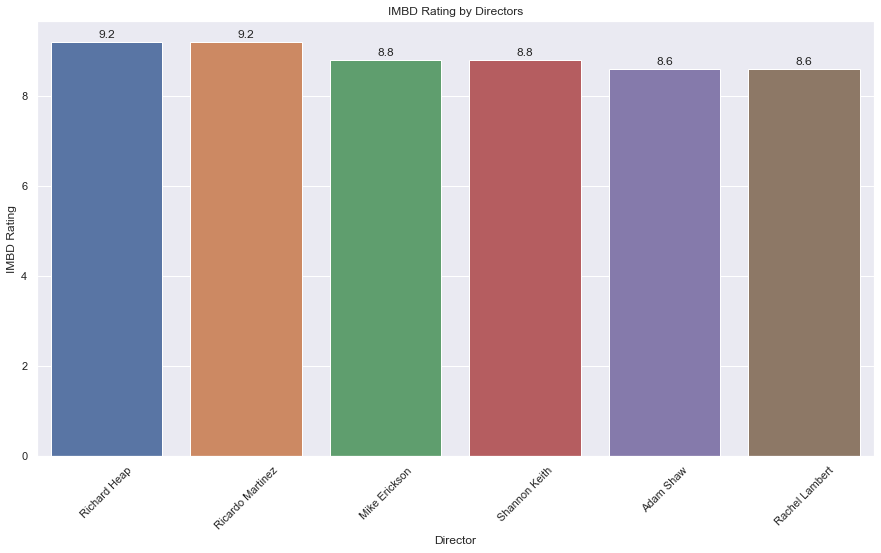

# Microsoft's New Movie Studio

## Overview

This project aims to give advice to Microsoft (hypothetically) on which types of movies to create for their new movie studio based on data from IMDB, TMDB, BOM and TN. The data is provided by Flatiron school and collected from the respective websites. 

Using explatory data analysis, I tried to understand what are some important factors for being successful in the industry.

## Business Problem

    The business needs general overview about the movie industry. 
    
    I believe deciding on the movie genre and the people to work with for the movie are important factors and is a good starting point for a new movie studio. Given the data, I think ratings and profit are good measures of success for a movie.
    
    If we understand which genres are more profitable and have higher ratings, the business can invest in those kind of movies. 
    
## Data Understanding

***
    The data is collected from Box Office Mojo, IMDB, Rotten Tomatoes, and TheMovieDB.org. The data has information about movie titles, genres, directors, actors, profits, release year.

    The data provides information about 16184 movies when merged on common columns. I have included information about movie genres, profit, primary people such as directors, writers and actors along with ratings.

    Target variables are the ratings and profit.

***

## Methods

### Data Preparation
***
    Here are the datasets that I used for analysis:
    
        imdb datasets: imdb_title_basics, imdb_title_crew, imdb_title_principals, imdb_title_ratings, imdb_name_basics

        tmdb dataset: tmdb_movies

        bom dataset: bom_movie_gross

        tn dataset: tn_movie_budgets
    
    I dropped the following columns from the data:

        original_title, primary_title, Unnamed: 0, genre_ids, id, nconst, tconst, original_language, release_date, start_year, birth_year, death_year, 
        known_for_titles,  'category', 'job', 'characters', 'vote_count', 'runtime_minutes', 'ordering'
       
    I created a value 'profit', which is simply the worldwide_gross minus production_cost.
       
    I dropped rows with missing worldwide_gross or production_cost values.
        
    I believe, dropping the nan values, rather than replacing them is an appropriate choice, since I want to provide accurate information.
        
    I later dropped studio, year, domestic_gross, foreign_gross, worldwide_gross columns, since they are not necessary for further analysis.

***

### Data Modeling

***
    I wanted to understand the profitability of different genres of movies.
   
    I also wanted to analyze the change of ratings for different genres. I checked both imdb and tmdb ratings.
    
    Secondly, I wanted to find out whom Microsoft should work with for the best profit. Which directors, writers or actors are deriving the most profitable movies and which of them have the best ratings?
    
    I used the domestic_gross and foreign_gross to calculate the profit at my first attempt. Then, I found out the information about production_budget, so I included that in the calculation to get a better result.
    
    I think deciding the genres of the movie and whom to work with based on the profit and ratings is a good step for a first attempt at creating a new movie studio. This will give an general sense of the indsutry.
    
***

## Evaluation

***
    We have some general knowledge about how to make a profitable and popular movie in terms of genres and directors, writers and actors. I think this is a good first step in analysis.
    
    I think these results would generalize beyond this data because there are 16184 movies, which is a quite large number.
    
    I think this analysis will be helpful in choosing genres and people to work with.
***

## Conclusions

***
    In terms of best movie genres for the highest profit, here are the top 10 genres that I would recommend:
        
        1. Adventure,Drama,Sport
        2. Biography,Documentary,History
        3. Sci-Fi
        4. Documentary,Drama,Sport
        5. Adventure,Drama,Sci-Fi
        6. Comedy,Mystery
        7. Action,Adventure,Sci-Fi
        8. Adventure,Fantasy
        9. Family
        10. Animation,Comedy,Family
        

        
        One important note about this list is it gives a combination of genres instead of one. That is how the original data was provided, thus the result is recommending a mix of genres for a new movie. 
        
        Also, for the highest profit, the company should consider the top names to work with for a new movie. Some of them are directors, some of them are writers and some of them are actors. Here are the top 10 people that brought in the highest profit:
        
        1. Michael Crichton
        2. Joe Robert Cole
        3. Rafe Spall
        4. Idina Menzel
        5. Shane Morris
        6. Kristen Anderson-Lopez
        7. Peter Del Vecho
        8. Peter Block
        9. Adam Green
        10. Hans Christian Andersen


        
        In terms of ratings, IMDB and TMBD had different results on the best genres. 
        
        Here are the top 10 movie genres by average votes on TMDB:
        
        1. Documentary,History
        2. Mystery,Thriller
        3. Biography,Drama,Musical
        4. Adventure,Drama,Sci-Fi
        5. Crime,Documentary
        6. Drama,Fantasy,Music
        7. Adventure,Drama,Western
        8. Drama,History,Thriller
        9. Biography,Drama,History
        10. Action,Adventure,Animation



        And, here are the top 10 genres according to IMDB ratings:
        
        1. Adventure
        2. Action,Sport
        3. Crime,Documentary
        4. Adventure,Drama,Sci-Fi
        5. Mystery,Thriller
        6. Sport
        7. Adventure,Drama,Mystery
        8. Comedy,Musical
        9. Adventure,Drama,Western
        10. Biography,Drama,Musical



        Again, in terms of ratings, IMDB and TMBD had different results on the best people to work with. 
        
        Here are the top 10 people by average votes on TMDB:
        1. Ben Sollee
        2. Allison Shearmur
        3. Neal Kingston
        4. Georgina Haig
        5. Miles Heizer
        6. Sebastien Guy
        7. Nina Dior
        8. Ben Evans
        9. Christian Clark
        10. J.R. Sawyers



        Here are the top 10 people by average votes on IMDB:
        1. Tara Fitzgerald
        2. Andrew Swarbrick
        3. Richard Heap
        4. Mark Addy
        5. Scott Nicol
        6. Lee Boardman
        7. Mario Roberto
        8. Mark Thomas
        9. Laura Perez
        10. Phil Wood



        I think there are many other factors to consider, such as the time of the year, the economy or any crisis going on, that are not included in this analysis. Therefore, this primary analysis will give a general idea about where to start, but more analysis should be done for better understanding of the industry.
        
        I can focus on directors, or actors in specific instead of people in general. I can also seperate genre categories and do a more comprehensive analysis.
***


## Repository Structure

dsc-phase1-project-template.ipynb is a Jupyter Notebook containing all analysis and visualizations for the project.

DS_Project_Presentation.pdf contains presentation for the project.

Data folder contains zipped data about movies and provided by Flatiron School for the project. Data comes from IMDB, Rotten Tomatoes, and TMDB and Box Office Monjo.

Images folder contains the visualization created for analysis.
```
├── README.md                           <- The top-level README for reviewers of this project
├── dsc-phase1-project-template.ipynb   <- Narrative documentation of analysis in Jupyter notebook
├── DS_Project_Presentation.pdf         <- PDF version of project presentation
├── data                                <- Both sourced externally and generated from code
└── images                              <- Both sourced externally and generated from code
```
